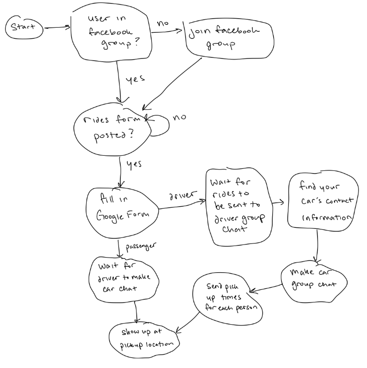
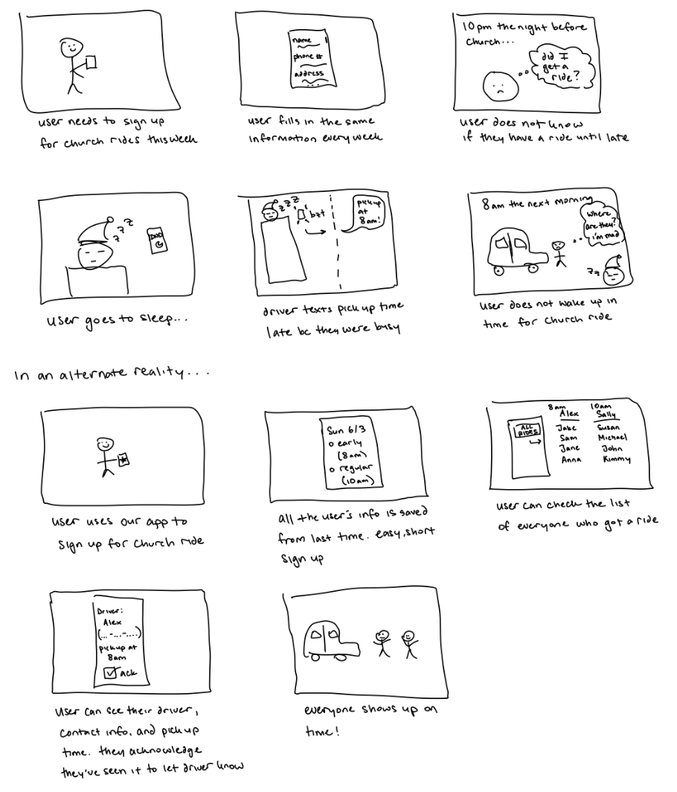
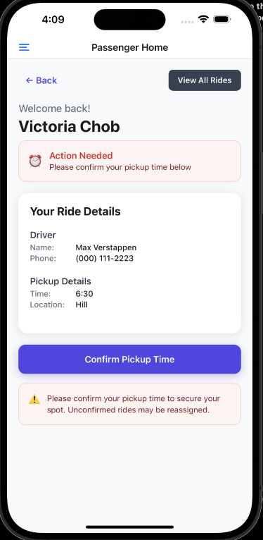
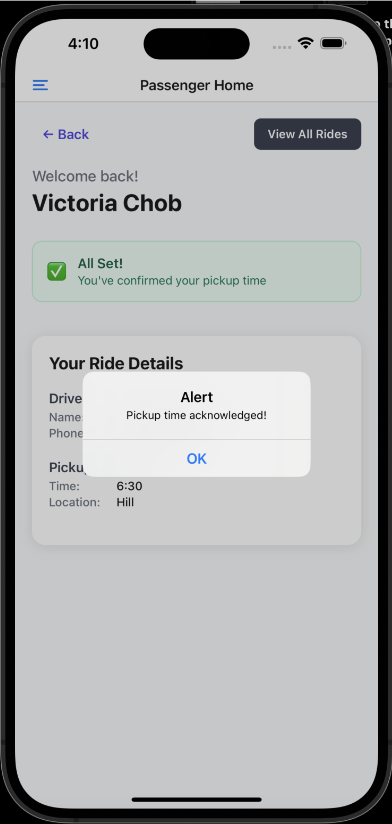
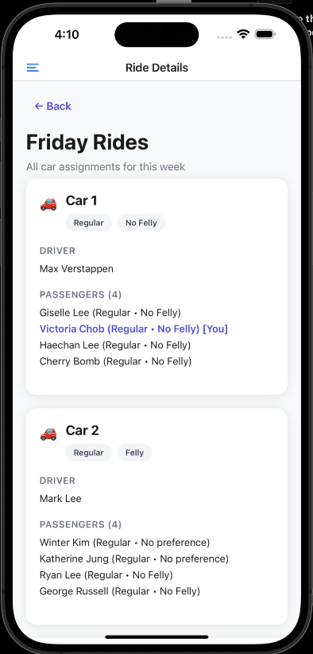
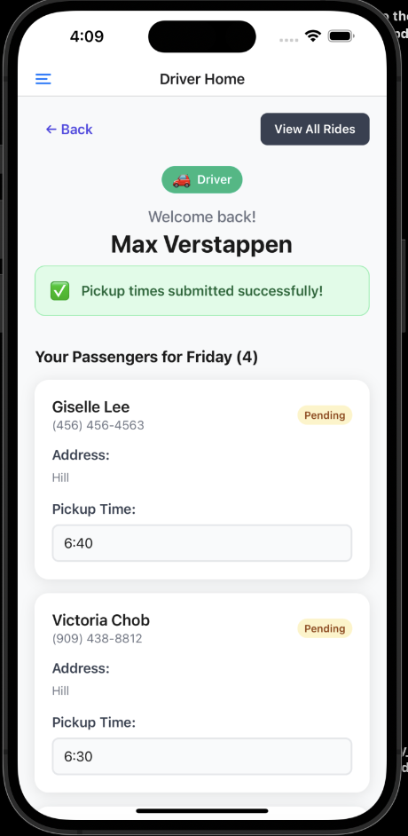
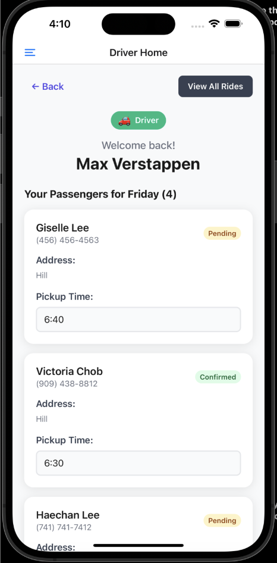
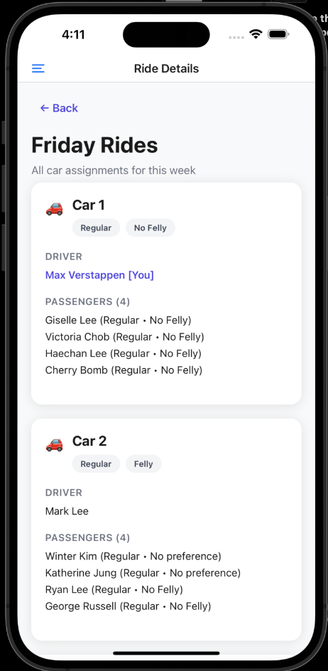
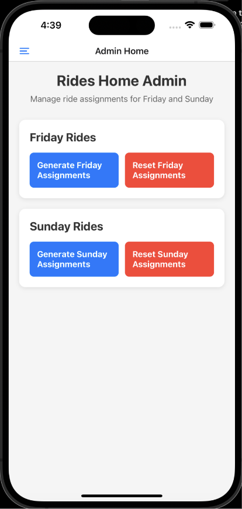
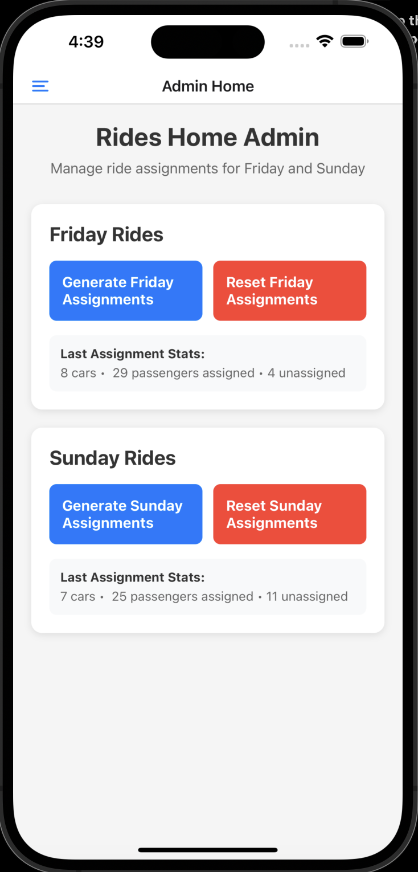

# Rides Center

Team members: Eunice Ahn, Joshua Ahn, Victoria Choi, Ryan Yeo

## Hypothesis

**While the current church carpooling system is functional, it places logistical and social pressures on drivers, passengers, and ride coordinators.**

Emily, a freshman at UCLA, recently signed up for a carpool ride to church through a google form shared by a friend who already attends the church. It was her first week attending, and although she was excited to go again, she wasn’t yet quite sure how the ride process worked. Would someone text her? Was she confirmed? Should she reach out first? She kept checking her phone but heard nothing until late Saturday night, when she was finally added to a group chat.

"Hey everyone, I’ll pick you up at 10:00am tomorrow\!" wrote Terrence, her driver. Emily, unsure if she needed to respond, reacted with a thumbs-up emoji. The next day, Emily was already waiting outside by the time Terrence pulled up. She didn’t want to make the wrong impression or risk being late. But one of the other passengers hadn’t shown up yet and also hadn’t responded to the pickup message either.

Terrence followed up with another message in the group chat, but still received no reply. Frustrated and beginning to feel the pressure of running behind schedule, he eventually called the missing rider directly. The missing passenger finally answered and explained they were unable to come to church anymore and that they had already let a ride coordinate know earlier that day. Terrence, now running behind schedule, felt frustrated that no one had relayed the message to him. He thanked the passenger, ended the call, and finally began driving to church. Unfortunately, they are now running late.

This moment reveals a deeper truth about the church carpool system: it is more than just logistics but a socially charged space with tensions and obligations that users navigate differently depending on their role, personality, and familiarity with the community. To better understand these tensions, our team conducted user research on carpool rides within Los Angeles-based communities that are present at UCLA.

## Problem Statement

While the current church ride system functions at a basic level, coordinating rides to church is often a logistically burdensome and socially uncomfortable process for everyone involved. Riders, drivers, and ride coordinators want greater flexibility, timely accountability, and social ease to create a smoother, more reliable carpooling experience.

Our project will aim to address these areas of need by developing a tool to help improve communication, clarify responsibilities, and foster more socially comfortable ride environments. By reducing last-minute changes and simplifying coordination tasks, we hope to improve the overall carpooling experience and encourage a more positive, stress-free atmosphere for everyone involved.

## User Research: What’s really happening in the church carpool experience?

Our user research focused on college students between ages 18–22, the primary users of these ride systems. To better understand the needs of the current carpool system users, we conducted two methods of user research:

- A series of in-person interviews with drivers, passengers, and ride coordinators.
- An anonymous survey designed to quickly gather feedback from a broader audience.

By combining these methods, we were able to capture the advantages of both qualitative insights and quantitative data. In particular, the interviews helped us observe emotional responses and social dynamics in ways that a survey alone could not. Our user research was conducted on both regular churchgoers and newcomers to capture a wide range of experiences. The in-person interviews provided a deeper, more comprehensive understanding of user experiences through direct observation, while the survey allowed us to reach a larger sample and identify broader patterns across users.

### Study Structure

The in-person interviews followed the following setup:

1. **Background questions**

   The purpose of this section was to understand the level of experience the interviewee had with the carpooling system. Additionally, we used this section to classify our interviewees as a driver, passenger, or ride coordinator, and asked them to self-assess their level of extrovertedness. The purpose of this was to help us explore whether personality traits such as extrovertedness influenced their desire for social interaction during the carpool ride.

2. **Role-based questions**

   After identifying their role, participants were asked a corresponding set of questions designed to capture the unique perspectives, motivations, and pain points associated with that role.

   **Driver Questions:**

   For drivers, we focused on expectations they may have for their car, especially socially, and the frustrations that could occur from a logistical and timely point of view. Some driver-specific questions that we asked include:

   - Describe generally your most unideal passenger. Why are these traits unideal for you?
   - How do you feel about a passenger who is late or does not respond? Why do you feel this way?

   **Passenger Questions:**

   For passengers, we aimed to understand their preferences, comfort levels, and experiences during the ride. Some passenger-specific questions that we asked include:

   - Do you prefer certain drivers over others? Why or why not?
   - How do you feel about going to church in an Uber?
   - Do you prefer quieter or louder cars?
   - How do you feel during the car ride to and from church?

   **Ride Coordinator Questions:**

   For ride coordinators, we explored the logistical demands of their role and the certain pain points that may arise from that standpoint. Some ride-coordinator specific questions that we asked include:

   - How do you feel organizing the church rides for Fridays and Sundays?
   - What is the process (of coordinating rides), and how long does it take?
   - How do you feel when people drop or change rides last minute? How long does it take to fix it?

In addition to the role-specific questions, all interviewees were asked to describe what they are hoping for when they first see who is in their car on the carpool rides list and why they may be hoping for this. We also ended the interview with a reflective question asking for any personal feedback the interviewee may have for the existing ride system that might not have emerged during the previous questions.

### Key Findings: Personas and Scenarios, and Process Map

Through our user research, we identified two distinct personas that emerged from recurring patterns in user responses. These personas helped us understand not only how different people interact with the carpool system, but also the emotional and social contexts they bring into those interactions.

- **Terrence \- Senior Driver, Student Leader**  
  Terrence is a senior at UCLA who has been attending church by carpooling for the past 4 years in college. He is 6/10 extroverted and enjoys a lively, respectful ride experience. He would like his car to not be too quiet but also not too loud. Additionally, he is a student leader who feels he has an obligation to make a welcoming environment for the passengers in his car. He also emphasized a desire for clearer communication and more appreciation for the role drivers play—both socially and logistically.
- **Emily \- Freshman, Newcomer**  
  Emily is a freshman at UCLA who has been checking out the carpooling system for a few weeks after being invited to church by a friend. She is on the introverted side and wants to be with people she feels more familiar with since she does not know many people yet. She is also nervous about asking questions or making conversations with upperclassmen. Her experience reflects the uncertainty and anxiety that many new users face when interacting with the carpool system for the first time.

### Interview Findings

Our interview findings reveal some key points of issues that could be helpful to constructing our design goals.

- **Logistical Confusion**

  Newcomers like Emily often don’t know when or how they’ll be contacted after signing up. Pickup times are often sent last-minute, leading to anxiety and unclear expectations.

- **Driver burden**

  Drivers are responsible for coordinating all aspects of the ride including pickup times, group chats, and all other forms of communication with ride coordinators without any formal support. Unresponsive or last-minute cancellations from passengers add stress, especially when drivers must manage changes on the day of the ride.

- **Social dynamics matter more than expected**

  Regardless of how extroverted they were, many passengers preferred being in cars with familiar or conversational people. Silence during rides often felt awkward and uncomfortable. Drivers, in particular, felt a pressure to carry conversation, adding to their social load in addition to the logistical coordination.

- **Last minute changes disrupt everyone**

  When passengers drop from rides or fail to communicate changes in a timely manner, it disrupts the entire system. Even when ride coordinators are informed, sometimes drivers are often left in the dark as all these changes are taking place mere hours before pickup times, resulting in confusion, wasted time, and delayed arrivals.

By identifying these challenges, we gain insight into how the current carpooling system places uneven burdens on participants, reinforcing the need for tools to help improve communication, reduce stress, and create a more reliable and socially comfortable experience for everyone involved.

The figure below maps out the typical process of the current carpool system. Throughout this flow, we can highlight points where the logistical burden falls on drivers which could lead to delaying the start of pickups or create inefficiencies in the overall system.

### Storyboard

The storyboard below illustrates the process that users follow to sign up for church rides and shows how a new tool that addresses our key findings would improve that experience.  
Some components of our proposed system include:

- A clear interface for passengers to view ride status and car assignments
- Automated push notifications for ride updates, cancellations, or changes
- Required passenger confirmations to ensure clarity around pickups
- Optional "conversation starters" to ease social tension during rides
- Passenger accountability tracking (e.g., number of drops) to encourage reliability and reduce last-minute cancellations

By incorporating transparency, accountability, and socially supportive features, the system aims to reduce the logistical burden on drivers, increase reliability, and promote a more comfortable and connected carpooling experience for all users.

### Looking towards Design Goals

Church carpool rides are not just transportation but micro-communities. Our user research reveals that users want more than a ride: they want a clear, respectful, and comfortable experience.  
Moving forward, our design goals will center on the following principles:

### 1. Transparency:

**What is the goal?**

Our system will be designed to support transparency for all users, helping ease anxiety for both passengers and drivers.

**Why is it important?**

Survey and interview data revealed a widespread desire among passengers to know more about who is in their car and what’s happening behind the scenes. Uncertainty about car assignments, pickup details, or who their fellow passengers are often led to discomfort and frustration:

- "if I don’t have people’s phone numbers—not knowing who else (other than my driver) is in my car until I show up."
- "Not being able to match numbers to names if you are a passenger."
  Drivers expressed frustration over unclear communication as well, especially when passengers didn’t acknowledge pickup details:
- "When people don’t like my message I have no idea if they’re going to show up at the pickup time."  
  Additionally, both riders and drivers were stressed by inconsistent ride release times and a lack of visibility into whether the ride list had been published:
- "Sometimes it can take until very close to the time of Friday service to find out my rides."

**How will we design for this?**

We will make the complete list of cars (with drivers and passengers) viewable to all users. Additionally, to confirm ride participation, passengers will be required to acknowledge their pickup time and location by a certain deadline.

### 2. Enforcing Accountability:

**What is the goal?**

Our system should promote accountability among both riders and drivers by encouraging timely communication, minimizing uncertainty, and reducing last-minute changes.

**Why is it important?**

Users repeatedly emphasized how stressful it is when rides are released or updated late. Passengers feel left in the dark, and ride coordinators are forced to scramble to make changes on short notice:

- "Sometimes we do not get to know our rides till very late."
- "People frequently request rides late… very difficult for our ride coordinators."

**How will we design for this?**

We can implement a pickup confirmation system, requiring passengers to acknowledge their assigned pickup time by a certain deadline. By encouraging timely communication and confirmations, the system will promote reliability and reduce the frequency of last-minute cancellations from both riders and drivers.

### 3. Comfortable Social Environment:

**What is the goal?**

Our system will support a welcoming and friendly atmosphere, helping riders and drivers feel more at ease and connected during the ride.

**Why is it important?**

Many users, especially student leaders and drivers, expressed a sense of responsibility to make the car environment inviting. However, this effort often feels stressful:

- "I feel burdened to keep engaging people in conversation…"
- "It is important to facilitate conversation in a car, especially since as student leaders we are supposed to make a welcoming environment."

Riders also expressed enthusiasm for more social, talkative cars:

- "Talkative people because loud cars are more fun\!"
- "Other people who are willing to make conversation, especially if there is a newcomer…"

**How will we design for this?**

We can incorporate user responses to help inform car assignments—either grouping people with similar interests or mixing responses to encourage diverse conversations.

## System Design

### Passenger Flow

Passengers sign up for an account using their phone number on the **Welcome Page**. They receive a text with a six digit verification code, which they input in the **Phone Verification Page**.

When they first enter the app, they fill out their name, grade, and pickup location information on the **Profile Page.** Their phone number is already pre-filled out. Once they save their profile, they are routed to the rides home. Passengers can also edit their profile after they fill it out.

The **Rides Home** has information about the weekly rides signup and includes information about the deadlines. There are three buttons: "Sign up for a Ride", "View Friday Rides", and "View Sunday Rides". The "View Friday Rides" and "View Sunday Rides" are grayed out, because passengers can only view their rides once they sign up for a ride.

When passengers want to sign up for a ride, they click the "Sign up for a Ride" button and are taken to the **Rides Signup Page**. They can input "Passenger", their time preferences ("Early", "Regular", and "No time preference") for Friday and Sunday rides, their lunch preferences ("Yes", "No, go back early", and "No preference"), if they are a newcomer, and any comments or concerns they have. Their location information is already pre-filled out to remove redundancy, but passengers can change it if it is different. Once they submit the form, they are taken back to the **Rides Home**.

The Rides Home now has the "View Friday Rides" and "View Sunday Rides" button activated. Clicking on either takes them to the **Passenger Home**, where they can see their ride information for the respective day. If rides are not released yet, they see a "We’re Organizing Rides" message and a button to edit their sign up (Figure 1). Once rides are released, they can see their driver’s name, driver’s phone number, pickup time, and pickup location (Figure 2).

Drivers have to send out a pickup time on their end. Until then, passengers see that their pickup time is "Not Yet Assigned" (Figure 2). Once drivers do so, passengers can see their pickup time and press "Confirm Pickup Time" (Figure 3 and Figure 4).

Passengers can also see the list of all rides using the "View All Rides" button. This will take them to the **All Rides Page**, where they can see the list of all drivers, passengers, and car groupings (Figure 5). The user’s name is highlighted to make it easier to identify themselves.

### Driver Flow

The driver’s flow is the same as the passenger flow until rides get released. Drivers will also sign up for an account on the **Welcome Page**, verify their account on the **Phone Verification Page,** input their information on the **Profile Page,** see deadlines and options to view Friday and Sunday rides on the **Rides Home Page,** and sign up for rides on the **Rides Signup Page.**  
Once they sign up for rides, they are taken back to the **Rides Home Page**, which now has the "View Friday Rides" and "View Sunday Rides" button activated. Clicking on either takes them to the **Driver Home**, where they can see their ride information for the respective day.

If rides are not released yet, they see a "We’re Organizing Rides" message and a button to edit their sign up. Once rides are released, they can see a list of passengers in their car. Drivers can see their passenger name, phone number, address, acknowledgement status. All passengers will have an empty pickup time and a "Pending" acknowledgement status.

Drivers have to send out a pickup time on their end. They can enter a pickup time for each of their passengers based on location. Once they do so, they’ll see a confirmation message (Figure 6). Once passengers confirm on their end, drivers can see that the passenger status is "Confirmed" (Figure 7).

Drivers can also see the list of all rides using the "View All Rides" button. This will take them to the **All Rides Page**, where they can see the list of all drivers, passengers, and car groupings (Figure 8). Their name is highlighted to make it easier to identify themselves.

### Admin Flow

The **Rides Home Admin** is where the rides matching takes place. Admin can reset rides and generate rides for Friday and Sunday (Figure 9). Once rides are generated, admin can see how many cars are generated, how many passengers are put into cars, and how many passengers are unassigned (aka put in Ubers) (Figure 10).

![][image11] ![][image12]  
 Figure 9 Figure 10

## System Implementation

### Frontend

We used React Native and Expo for our frontend. Screens are divided into four main categories: admin, login, profile, and rides. The admin home is where our rides algorithm is. It’s also where we can generate the rides for Friday and Sunday. The login goes through the welcome screen and phone verification flow. The profile goes through profile home and profile sign up. The rides go through rides sign up, rides home, passenger home, driver home, and all rides list.

### Backend Schema

We used a Firebase backend. We have Friday drivers, Friday passengers, Sunday drivers, Sunday passengers, and users collections.

### Algorithm

We designed our algorithm to consider the preferences of each passenger and driver. We shuffle the passengers to avoid bias. Then, we sort drivers by early, no preference, and regular. It is important that early drivers are prioritized, as passengers and drivers who have to leave early to church are usually volunteering and must be there early. We then create priority groups, weighing passengers in order of same time preference, same lunch preference, no time preference, and no lunch preference. We also prioritize grouping passengers who have the same location as the drivers. In the case that there are not enough drivers, the passengers are put in optimal groups of 4 or 6 to go to church in Ubers.

## System Evaluation

### Key Evaluation Questions

1\. Will our application make the process of signing up for rides less redundant and more efficient?  
2\. Will people be able to intuitively understand our application without someone having to sit down and explain it to them?

### Methodology

We conducted 12 in-person user evaluations with users who had not participated in any prior stages of our research or testing. Each user evaluation followed a structured walkthrough in order to collect uniform qualitative and quantitative data. During the evaluation, users were directed to act like a newcomer to church, create a profile, and sign up for a ride using our application. They were then directed to view their driver/passenger information and view all of the car assignments. Both of these tasks were timed in order to capture quantitative data regarding how easy it is for new users to understand and productively use the app. Users were also asked qualitative follow up questions to gauge which parts of the application they enjoyed and which parts they found confusing.

### Analysis Approach

We took a mixed methods approach, combining both our quantitative and qualitative data gathered from user evaluations. We used quantitative analysis of task completion times to assess efficiency gains and determine a benchmark of how quickly users should be able to use the application. We used qualitative analysis to analyze key issues with our application repeated across multiple user evaluations. We also used qualitative analysis to determine the points of ease for users, so we know which parts of our application are working well.

### Course Staff Feedback

When our application was separately evaluated by the course staff, they emphasized the importance of implementing a robust scheduling algorithm for assigning passengers to cars. Some key points were to ensure passengers are matched with drivers who match their preferences, converting excess drivers to passengers, or assigning remaining passengers into Uber groups to guarantee that everyone receives a ride. We were able to implement these changes before our final 4 user evaluations.

### Key Findings

1\. Users find our app simplifies and speeds up the ride sign up process, including reducing redundancy.

We determined that our app saves time for users, seeing that the profile creation and sign up flow took users around 2 minutes or less. Additionally, users will not have to create a new profile the second time they sign up for a ride, reducing the time even more. Also, viewing rides and driver information took as little as around 10 seconds for some users. In solving redundancy, users enjoyed that they did not have to re-fill out basic information on the ride sign up form and that their address was auto-populated into the form. Also, users were happy that ride assignments were automatically assigned, saving time for ride coordinators who previously had to sort cars manually. Lastly, users enjoyed that all aspects of the ride sign up process were centralized into one application. They were happy that all the information they wanted to know was easily displayed to them (e.g. driver information, view all car assignments).

2\. Users are able to easily navigate the app regardless of whether or not they’ve used a previous system to sign up for carpool rides to church.

We found that users were able to complete the entire sign up flow and viewing car assignment flow without needing any additional assistance or explanation. Users found the app’s screen flow to be very intuitive, with each step naturally leading to the next. Participants appreciated that each screen had a simple, minimal layout with only one or two clear navigation options, which reduced confusion. Additionally, users liked that buttons were disabled when not relevant, helping guide their next steps and prevent invalid actions. Newcomers in particular said the app was easy to use despite having no prior experience with church carpools. All 12 participants completed their assigned tasks without needing further clarification. From a UI perspective, users appreciated the app’s clean design and interface, with important deadlines and names visually emphasized on the screen.

One recurring error we found from our user evaluations was a UI bug where the keyboard popup on a mobile device would block the screen showing a text field that a user was trying to type in. Following the conclusion of our user evaluation period, we fixed this bug to improve the overall usability and experience of the application.

### Major takeaways

**Looking towards the future:** While we were able to implement many of the core functionalities of our rides system, there were several features we hoped to include but were unable to due to time constraints and other development limitations. As we look towards the future, we have identified a few additions that would significantly enhance user experience, communication, and administrative control.

1. **In-App Chat Feature**  
   One of the most requested features but our evaluations from both drivers and passengers was a built-in messaging system. While pickup times and locations are provided, users often have follow-up questions or last-minute changes that need to be communicated quickly and clearly. Currently, many rely on external apps through group chats. Although our application displays the individual phone numbers for further communication, an in-app chat would accommodate additional needs and keep communication consistent for all members of a car.
2. **Push Notifications for Time-Sensitive Reminders**  
   Currently, our system does not include any push notifications, however this is one of the critical features we hope to implement in the future. Introducing push notifications would allow the application to deliver timely, automated reminders for when the rides-signup form is open, when final rides lists are posted, when driver has sent time confirmation times, when the passenger has confirmed a pickup time, and shortly before a scheduled pickup.This would help improve clarity and reduce user uncertainty while also promoting accountability and ease the burden on drivers who have to manage reminders manually.
3. **Admin Control Panel for Manual Adjustments**  
   While our current system automates ride groupings based on user input and preferences, ride coordinators often need to make adjustments to accommodate special requests, manage drops, or rebalance car sizes, especially with the use of extra uber groups. A dedicated admin page would allow ride coordinators to override or fine-tune automated pairings in a more efficient and organized way. This layer of flexibility is important to handle urgent updates without compromising the overall structure of the system.

These features not only address real user pain points identified through our research but are also supported by the feedback we received during our user evaluations of our working platform. As we continue to refine our system, our goal remains the same: to create a rides coordination experience that is transparent, accountable, and socially engaging. While we weren’t able to implement everything within our current timeline, we’re optimistic about the future. We aim to make church carpooling not only more efficient, but also more thoughtful, inclusive, and user-friendly for everyone involved.
